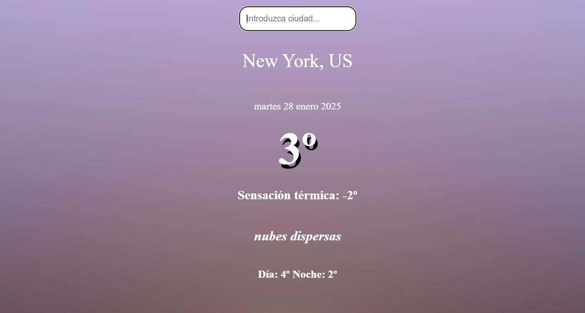

# Weather Application

##  Demo  
🔗 [View the app on Netlify](https://lily-weather.netlify.app)

## Project Description
This application allows you to check the weather in various cities around the world. It is built using HTML, CSS, and JavaScript.
The weather is fetched using an API, and asynchronous JavaScript is used. The app automatically detects the user's city and displays weather data on the main page upon the first launch.

No installation is required to use the application.

## Here’s what the app looks like:

### How to use:
1. Enter the name of the city in the input field.
2. The application will display the date, current temperature, how the temperature feels, cloudiness, and the maximum and minimum temperatures for the day in the specified city.

### Features:
- User location detection.
- Fetching weather data using an API.
- Intuitive interface.

## Requirements:
- Modern web browser with JavaScript support.
- Internet access for working with the API.
