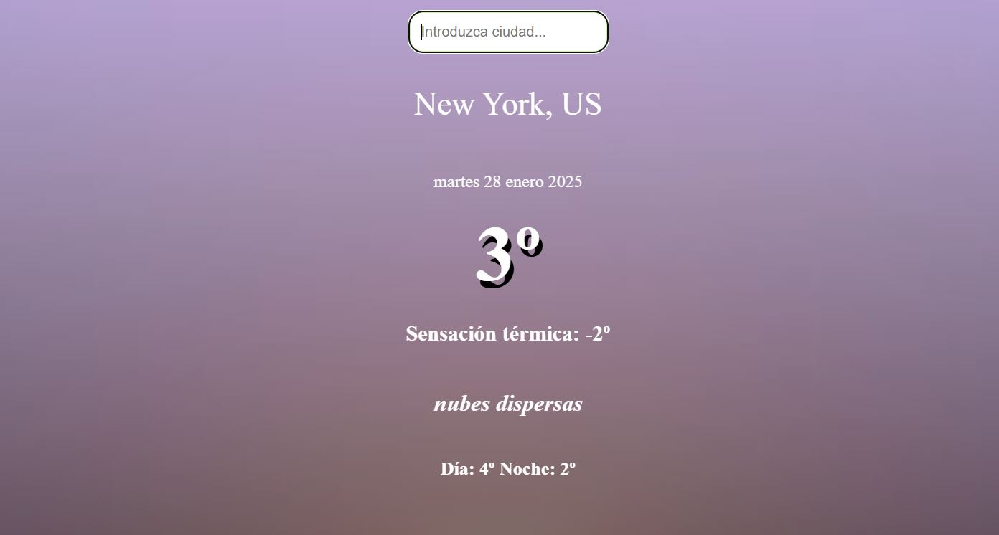

# Приложение о погоде

## Описание проекта

С помощью этого приложения можно посмотреть погоду в разных городах мира. Приложение создано с использованием HTML, CSS и JavaScript.  
Для работы с погодой используется API, а также асинхронный JavaScript. Приложение автоматически определяет город пользователя и выводит данные о погоде на главной странице при первом запуске.

Установка приложения не требуется.

## Вот как выглядит приложение:

### Как использовать:
1. Введите название города в строку ввода.
2. Приложение покажет дату, текущую температуру, ощущаемую температуру, облачность, самую высокую и самую низкую температуру за день в указанном городе.

### Функциональность:
- Определение местоположения пользователя.
- Получение данных о погоде с помощью API.
- Интуитивно понятный интерфейс.

## Требования
- Современный веб-браузер с поддержкой JavaScript.
- Доступ к интернету для работы с API.
